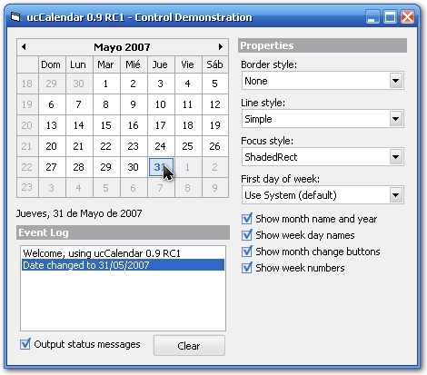



## ucCalendar

### Description

ucCalendar is an small and self contained user control that provides basic calendar functionality. With support for mouse and keyboard control, multiple border, line and even selection styles you can integrate it with ANY user interface.

I'm writing this control for a program and I wanted to share it. Feedback is always welcome (specially if you have found a bug or you've fixed one), so if you like please vote!
 
### More Info
 

             |
---                |---
**Submitted On**   |2007-05-31 13:24:24
**By**             |[BioHazardMX](https://github.com/Planet-Source-Code/PSCIndex/blob/master/ByAuthor/biohazardmx.md)
**Level**          |Advanced
**User Rating**    |5.0 (50 globes from 10 users)
**Compatibility**  |VB 6\.0
**Category**       |[Custom Controls/ Forms/  Menus](https://github.com/Planet-Source-Code/PSCIndex/blob/master/ByCategory/custom-controls-forms-menus__1-4.md)
**World**          |[Visual Basic](https://github.com/Planet-Source-Code/PSCIndex/blob/master/ByWorld/visual-basic.md)
**Archive File**   |[ucCalendar206909642007\.zip](https://github.com/Planet-Source-Code/biohazardmx-uccalendar__1-68741/archive/master.zip)

